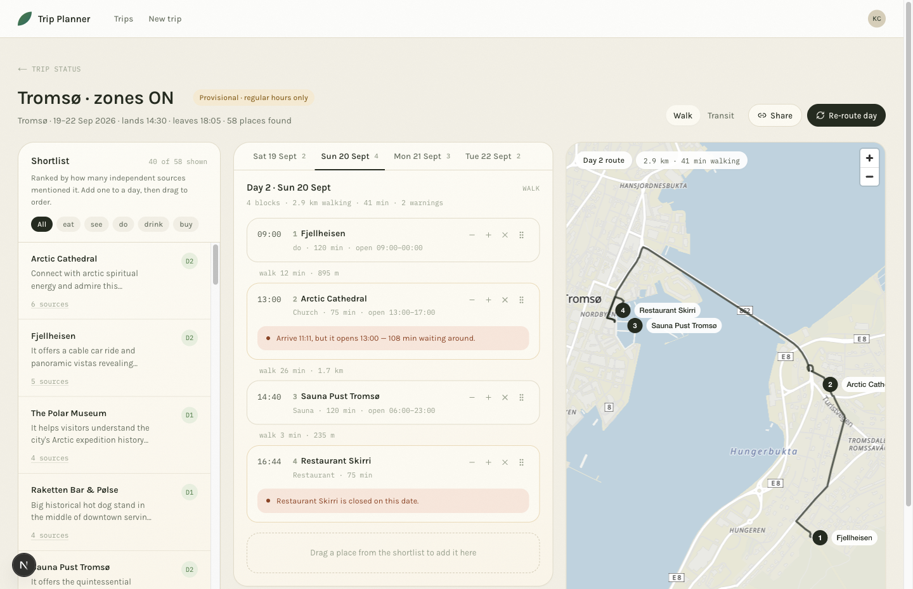

# Trip Planner

Enter a city, dates, flight times and one sentence about yourselves. We shortlist places from travel
videos and posts, show them as a list beside a map, and you drag them into order. We route that exact
sequence and warn about anything that does not work.

**We do not optimise the order.** The user controls it; our job is routing plus validation.



Day 2 of a Tromsø trip, live at `/trip/{trip_id}/plan`: ordered blocks with the real walking leg
between each pair, the route drawn across the bridge from `computeRoutes`, and two warnings the
validator found in an order the user chose — Arctic Cathedral opens at 13:00 but the walk gets you
there at 11:11, and Restaurant Skirri is closed that day. The title is editable; it falls back to the
city name. "Provisional" is there because holiday hours for a future date are unpublishable.

## How it works

City -> `youtube.search` / `rednote.search` -> extract place names per video or note -> resolve each
to a Google `place_id` -> rank by how many independent sources mentioned it.

- `place_id` is the identity, never the name. That is what makes cross-source counting work.
- Ingestion is a **shared per-city pool**: two people planning the same city join one run (partial
  unique index on `ingest_runs`), and a city is only re-ingested after `city_refresh_days`.
- It is async. `POST /initiate-plan` returns a `run_id` immediately; the client polls
  `GET /trips/{trip_id}`, which returns task counts grouped by kind and status.
- Queue is Postgres, no Redis. Tasks are claimed `FOR UPDATE SKIP LOCKED`, `locked_at` is a lease so
  a dead worker's task is reclaimed rather than stuck, and backoff is chosen by error class.

## Status

| Works today | Not built |
|---|---|
| Schema + Alembic migrations | Auth — so the owner/proposals split in the design is unenforced, and sharing is a link, not a permission |
| `POST /initiate-plan`, `GET /trips`, `GET /trips/{trip_id}` | A cached routed day, so a page reload re-spends one `computeRoutes` call per day viewed |
| Worker loop: claim, lease reclaim, retry/backoff | Pinned arrival times; a block's time is always derived from the order |
| `youtube.search`, `rednote.search`, which fan out follow-on tasks | Any frontend test runner |
| `places.resolve` — candidate names become `places` + `place_mentions` behind a query cache | Block detail, and the standalone ingesting/blocked pages |
| Versioned Gemini prompts in `libs/prompts` | |
| Shortlist, itinerary and per-day routing endpoints, validated against hours and daylight | |
| `tp_client`: plan form, trips list, and the shortlist/itinerary/map screen | |

## Getting started

A `uv` project rooted at `tp_backend/`. Needs Postgres and a repo-root `.env` (gitignored) holding
`DATABASE_URL`, `GOOGLE_API_KEY`, `GEMINI_API_KEY` and the `XHS_*` RedNote cookie/signature vars.

```bash
make install     # uv sync + npm ci
make dev         # migrate, then api + worker + web app; one Ctrl-C stops all of it
make help        # everything else: test, lint, migrate, revision, build
```

`make dev` serves the API on 8000 and the web app on 3000 (`API_PORT` / `WEB_PORT` to change either).
The pieces run standalone too — `make api`, `make web`, `make worker` — and `make test` creates and
migrates `<DATABASE_URL>_test`.

The worker calls a real logged-in RedNote account with a hard rate limit. Do not run it idly.

## Layout

| | |
|---|---|
| `tp_backend/` | API (`tp_api`), worker (`tp_ingestions`), schema and shared code (`libs`) |
| `tp_client/` | Next.js app: route handlers proxy `tp_api`, so no key reaches client JS |
| `spikes/` | throwaway exploration joined by JSON files on disk, not production code |
| `screenshots/` | design mockups |

[CLAUDE.md](CLAUDE.md) is the planning reference: sources, decisions, and the gotchas worth reading
before touching routing or hours — TRANSIT takes no intermediate waypoints and has a ~100-day
horizon, and holiday hours for a future date cannot be fetched, so a December plan built in August is
labelled provisional.
